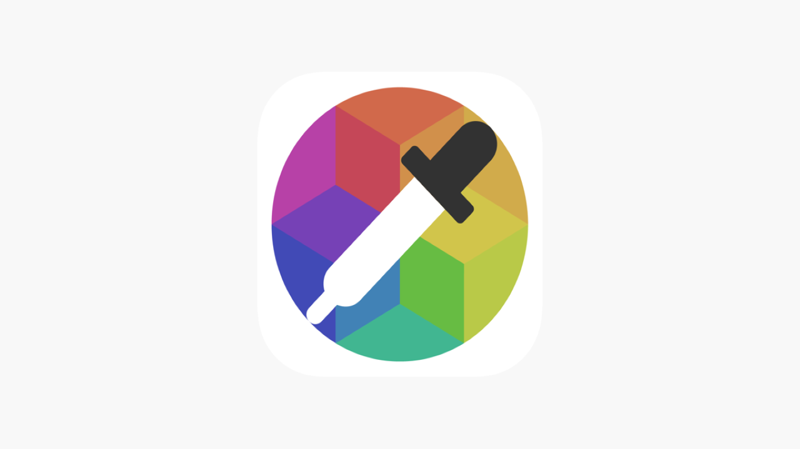

## Introduction

## Color detecton project is a small program that tells colors ;)

    

## After runing the program and choosing an image, click any where on the picture you have selected

## A pop up will shows up telling you the name of the color where you clicked
